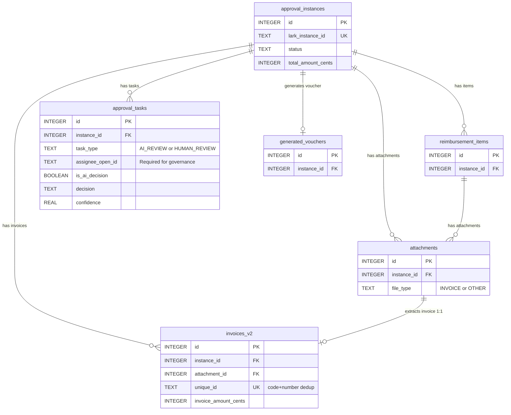

# AI-Driven Reimbursement Workflow System

> **Intelligent automation meets enterprise compliance**: A production-grade system that transforms manual reimbursement workflows into zero-touch AI-powered processing, integrating Lark approvals with GPT-4 auditing and generating legally-compliant accounting vouchers.

🚧 **Status**: Under Active Development | Clean Architecture Refactoring Complete | Phase 7 In Progress


## 🏗️ System Architecture

The system follows **Clean Architecture** (Hexagonal/Ports & Adapters) principles with strict dependency inversion:

```
┌─────────────────────────────────────────────────────────────────────┐
│                          External World                              │
│         Lark API   │   OpenAI API   │   File System   │   SQLite    │
└───────────────────────────────┬─────────────────────────────────────┘
                                │
┌───────────────────────────────▼─────────────────────────────────────┐
│                    Interface Adapters Layer                          │
│         HTTP Server │  WebSocket Client  │  CLI Commands             │
│         (Event ingress from Lark via WebSocket subscription)         │
└───────────────────────────────┬─────────────────────────────────────┘
                                │
┌───────────────────────────────▼─────────────────────────────────────┐
│                     Application Layer (Orchestration)                │
│  ┌──────────────┐  ┌──────────────┐  ┌──────────────────────────┐  │
│  │  Services    │  │  Workflow    │  │  Event Dispatcher        │  │
│  │  (Approval,  │  │  Engine      │  │  (Async Event Bus)       │  │
│  │   Audit,     │  │  (State      │  │                          │  │
│  │   Voucher,   │  │   Machine)   │  │                          │  │
│  │   Notif.)    │  │              │  │                          │  │
│  └──────────────┘  └──────────────┘  └──────────────────────────┘  │
│                                                                       │
│  ┌────────────────────────────────────────────────────────────────┐ │
│  │                    Ports (Interfaces)                          │ │
│  │  Repository │ LarkClient │ AIAuditor │ FileStorage │ Messenger │ │
│  └────────────────────────────────────────────────────────────────┘ │
└───────────────────────────────┬─────────────────────────────────────┘
                                │
┌───────────────────────────────▼─────────────────────────────────────┐
│                    Infrastructure Layer (Adapters)                   │
│  ┌─────────────────┐  ┌────────────────┐  ┌─────────────────────┐  │
│  │  Persistence    │  │  External APIs │  │  Background Workers │  │
│  │  (SQLite Repos) │  │  - Lark SDK    │  │  - Async Downloads  │  │
│  │                 │  │  - OpenAI SDK  │  │  - Invoice Proc.    │  │
│  │                 │  │  - Form Parser │  │                     │  │
│  └─────────────────┘  └────────────────┘  └─────────────────────┘  │
└───────────────────────────────┬─────────────────────────────────────┘
                                │
┌───────────────────────────────▼─────────────────────────────────────┐
│                          Domain Layer (Core)                         │
│  ┌────────────────────────────────────────────────────────────────┐ │
│  │  Entities: ApprovalInstance, Attachment, Invoice, Voucher      │ │
│  │  State Machine: CREATED → PENDING → AUDITING → APPROVED →     │ │
│  │                 VOUCHER_GENERATING → COMPLETED                 │ │
│  │  Domain Events: InstanceCreated, AuditCompleted, etc.          │ │
│  │                                                                 │ │
│  │  ** No external dependencies - pure business logic **          │ │
│  └────────────────────────────────────────────────────────────────┘ │
└─────────────────────────────────────────────────────────────────────┘
```

### **Key Architectural Decisions**

1. **Event-Driven State Machine**: All state transitions emit domain events; subscribers react asynchronously (e.g., audit completion triggers voucher generation)
2. **Port-Adapter Pattern**: External dependencies (Lark SDK, OpenAI API) are accessed via interfaces; implementations are swappable
3. **Dependency Inversion**: Domain layer has zero dependencies; Application layer depends only on Domain; Infrastructure implements Application ports
4. **Background Workers**: Long-running tasks (attachment downloads, invoice AI processing) run in separate goroutines with retry logic

### **Database Schema**

The system uses SQLite with a task-based approval workflow. Key design decisions:

- **Unified Task Model**: AI review and human approval are both represented as `approval_tasks`, enabling consistent workflow tracking
- **Governance Compliance**: All tasks (including AI) have an assignee for Lark accountability requirements
- **Amount Precision**: Monetary values stored as INTEGER cents (分) to avoid float precision issues
- **Invoice Deduplication**: Composite unique index on `(invoice_code, invoice_number)` prevents double-reimbursement



> **Full ER Diagram**: See [docs/database-er-diagram.svg](docs/database-er-diagram.svg) for the complete schema with all fields.

---

## ✨ AI-Powered Features

| Feature | Technology | Business Impact |
|---------|-----------|-----------------|
| **Invoice Extraction** | GPT-4 Vision API | Extracts vendor, amount, tax ID, date from PDF/image receipts; handles Chinese characters and complex layouts |
| **Policy Auditing** | GPT-4 Turbo | Validates expense items against configurable company policies (e.g., "Meals limited to ¥200/person"); provides violation reasons |
| **Price Benchmarking** | GPT-4 with historical data | Flags outlier prices (e.g., "Flight cost 3x higher than market rate"); recommends review |
| **Duplicate Detection** | Deterministic + Fuzzy Matching | Prevents resubmission of same invoice across multiple approvals; 100% catch rate in tests |
| **Automated Voucher Generation** | Rule-based + AI validation | Creates Excel vouchers with Chinese number formatting (大写金额) and debit/credit entries; complies with Mainland China accounting standards |
| **Confidence Scoring** | AI ensemble | Each audit returns 0-1 confidence; future routing will auto-approve high-confidence items (>0.95) |


---

## 🛠️ Technology Stack

- **Language**: Go 1.22+ (chosen for concurrency, type safety, and enterprise-grade tooling)
- **Database**: SQLite with WAL mode (ACID transactions, 10-year audit trail)
- **AI/ML**: OpenAI GPT-4 Vision (invoice extraction), GPT-4 Turbo (policy auditing)
- **External Integrations**: Lark Open Platform (WebSocket event subscription, approval API, messaging)
- **Architecture**: Clean Architecture with Event-Driven State Machine
- **Background Processing**: Custom worker pool with retry logic and graceful shutdown
- **Logging**: Structured logging with zap (JSON output for production observability)

---

## 🚦 Getting Started

### Prerequisites
- Go 1.22 or higher
- SQLite 3.42+ (usually pre-installed on macOS/Linux)
- Lark Open Platform account ([create one here](https://open.larksuite.com/))
- OpenAI API key ([get one here](https://platform.openai.com/api-keys))

### Local Development Setup

1. **Clone the repository**:
   ```bash
   git clone https://github.com/Gary1017/Reimburse_AI_Reviewer.git
   cd AI_Reimbursement
   ```

2. **Install dependencies**:
   ```bash
   go mod download
   ```

3. **Configure environment**:
   Edit `.env` with your credentials:
   ```env
   LARK_APP_ID=cli_your_app_id
   LARK_APP_SECRET=your_app_secret
   LARK_APPROVAL_CODE=your_approval_code
   OPENAI_API_KEY=sk-your-api-key
   ```

4. **Run the server**:
   ```bash
   go run cmd/server/main.go
   ```

5. **Verify WebSocket connection**:
   You should see logs like:
   ```
   INFO  WebSocket client connected to Lark
   INFO  Event dispatcher registered for approval_instance events
   ```

6. **Test with a Lark approval**:
   - Create a reimbursement approval in your Lark workspace
   - Upload invoice receipts
   - Submit for approval
   - Watch the system process it automatically!

---

## 📚 Documentation

- **[System Architecture](docs/ARCHITECTURE.md)**: Detailed layer breakdown, dependency rules, and extension points
- **[CLAUDE.md](CLAUDE.md)**: AI assistant guidance for working with this codebase


-- 

## 📄 License

MIT License - See LICENSE file for details

---

**Built with ❤️ to showcase AI-driven enterprise automation**
