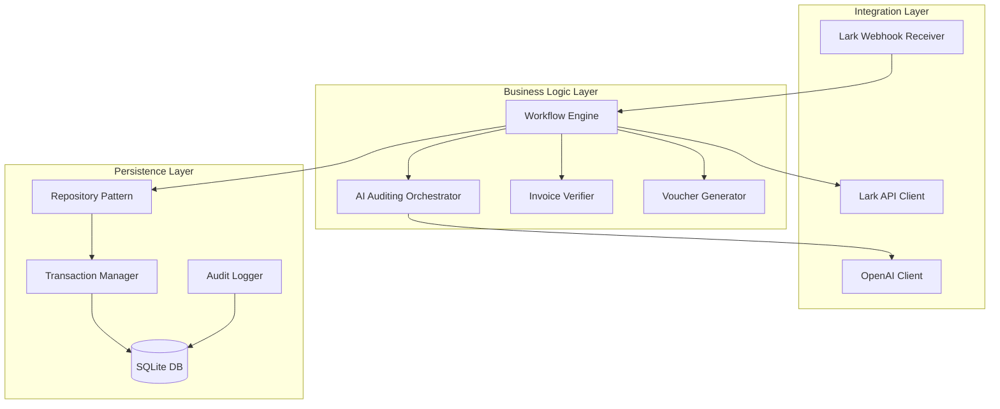
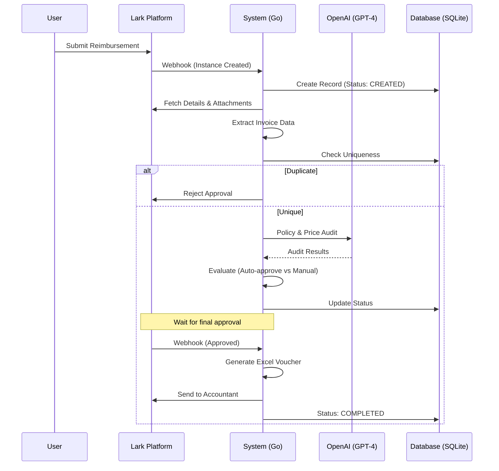

# AI Reimbursement Workflow System - Architecture Design

## 1. System Overview

The AI-Driven Reimbursement Workflow System automates the entire reimbursement lifecycle, integrating Lark's approval workflow with AI-powered auditing and seamless external accountant collaboration.

**Core Principles:**
- **Zero-Touch Processing**: Minimize manual intervention via intelligent AI-driven validation
- **Financial Audit Readiness**: Immutable audit trail, compliant vouchers, duplicate prevention
- **High Availability**: Graceful degradation, retry logic, idempotent operations
- **Extensibility**: Plugin-friendly architecture for custom policies, benchmarking models, and exception handlers

## 2. Component Architecture

The system is structured into three distinct layers, ensuring separation of concerns and maintainability.

### 2.1 Integration Layer
- **Lark Webhook Receiver**: RESTful endpoint that handles real-time events from Lark (Challenge-response, Signature validation).
- **Lark API Client**: Wrapper for the Lark SDK to query instance details, download attachments, and send messages.
- **OpenAI Client**: Manages communication with GPT-4 for semantic policy validation and price benchmarking.

### 2.2 Business Logic Layer
- **Workflow Engine**: A state machine that orchestrates the lifecycle of a reimbursement (CREATED → PENDING → AI_AUDITING → APPROVED/REJECTED → VOUCHER_GENERATING → COMPLETED). Implements idempotency and status persistence.
- **AI Auditor** (ARCH-001, ARCH-004): Coordinates policy checks (PolicyValidator) and market price analysis (PriceBenchmarker), producing a confidence score and decision. **Gap**: Currently lacks configurable confidence thresholds for auto-approval vs. exception routing.
- **Invoice Uniqueness Checker** (ARCH-003): Extracts and validates invoice codes from form data to prevent duplicate submissions. Uses database lookups with transaction isolation.
- **Voucher Generator** (ARCH-006): Transforms approved items into compliant Excel accounting vouchers with Chinese number formatting and audit trail metadata.
- **Exception Manager** (ARCH-008, Planned): Routes low-confidence audits or policy violations to Lark approval queue for human review.

### 2.3 Persistence Layer
- **Repository Pattern**: Abstracts database operations for instances, history, and vouchers.
- **Transaction Manager**: Ensures ACID compliance, critical for financial data integrity.
- **Audit Logger**: Maintains an immutable 10-year audit trail of all status changes and actions.

## 3. Data Flow

The following diagram illustrates the end-to-end processing of a reimbursement request.

## 4. Security Architecture

- **Authentication**: Webhook signatures are validated using AES + SHA256. API credentials are stored as environment variables.
- **Data Protection**: 10-year retention for audit trails. Parameterized SQL queries prevent injection.
- **Compliance**: Vouchers generated follow Mainland China accounting standards, including Chinese number capitalization.

## 5. Scalability & Maintenance

- **SQLite**: Optimized with WAL mode for high concurrency. Suitable for up to 1000 approvals/day.
- **Monitoring**: Zap structured logging and a `/health` endpoint for uptime tracking.

## 6. Known Limitations & Roadmap Gaps (Phase 4/5)

### Current State (Phase 1–3)
- ✅ Synchronous webhook handling with fast-path validation
- ✅ AI auditing with confidence scores
- ✅ Invoice deduplication
- ✅ Voucher generation and email delivery
- ✅ ACID transaction safety

### Known Gaps (To be addressed in Phase 4/5)

| Gap | Root Cause | Impact | Planned Solution |
|-----|-----------|--------|------------------|
| **Attachment Download Blocking** (ARCH-007) | Synchronous downloads in webhook handler | High webhook latency (100ms–5s per file); timeout risk | Async worker queue with polling; mark attachments as PENDING |
| **No Adaptive Approval** (ARCH-008) | Fixed audit logic without threshold config | Cannot auto-approve high-confidence items; all items go to Lark queue | Configurable confidence thresholds; ExceptionManager routes to human review |
| **Missing Observability** (ARCH-009) | Structured logs only, no metrics/tracing | Cannot detect SLO violations or bottlenecks in production | Prometheus metrics (approval duration, AI score distribution); OpenTelemetry tracing |
| **SQLite Single-Node** (ARCH-010) | No distributed database | Cannot scale horizontally beyond 1000 approvals/day | Prepare for PostgreSQL migration; implement read replicas |
| **No Retry Logic** | Synchronous calls fail on transient errors | Lark API timeouts cause workflow stalls | Implement exponential backoff with jitter; idempotent operation keys |
