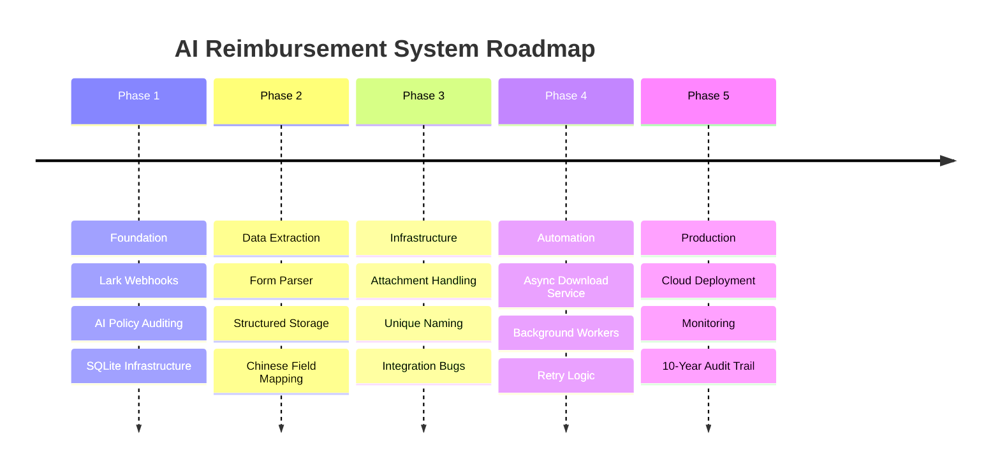

# Development Design & Roadmap

## 🎯 Ultimate Goal

Build an enterprise-grade, zero-human-touch reimbursement workflow system that:
1. **Integrates seamlessly** with Lark approval processes via real-time webhooks
2. **Automates compliance auditing** using AI (policy validation + market pricing)
3. **Prevents financial fraud** through duplicate detection and invoice uniqueness checks
4. **Generates audit-ready vouchers** compliant with Mainland China accounting standards
5. **Maintains a 10-year immutable audit trail** for regulatory compliance
6. **Scales to high-volume deployments** (1000+ approvals/day) with production-grade reliability

This document outlines the step-by-step plan to achieve the target architecture and tracks the progress of each phase.

## 🗺️ High-Level Strategy

The development follows a phased approach, starting from core integration to complex AI-driven automation.

## 📈 Step-by-Step Implementation Plan

### Phase 1: Foundation (✅ Completed)
Established the primary communication link between Lark and the system.

**Milestones:**
- ✅ Webhook signature verification (SHA256 + AES encryption)
- ✅ Initial GPT-4 policy auditing (PolicyValidator)
- ✅ Basic database schema for tracking (SQLite with migrations)
- ✅ Event routing and state management (Workflow Engine)

**Report**: [PHASE1_FOUNDATION.md](DEVELOPMENT/PHASE1_FOUNDATION.md)

### Phase 2: Data Extraction (✅ Completed)
Focused on parsing the complex widget structures of Lark forms.

**Milestones:**
- ✅ FormParser implementation (multi-widget support, Chinese field normalization)
- ✅ Reimbursement item extraction (TRAVEL, MEAL, ACCOMMODATION, EQUIPMENT, OTHER)
- ✅ Invoice code uniqueness validation
- ✅ Database persistence of parsed items with audit trail

**Report**: [PHASE2_DATA_EXTRACTION.md](DEVELOPMENT/PHASE2_DATA_EXTRACTION.md)

### Phase 3: Attachment Handling (✅ Completed)
Building the infrastructure for receipt management and voucher generation.

**Milestones:**
- ✅ Attachment repository and data models (PENDING → DOWNLOADED → ARCHIVED)
- ✅ Secure file path validation (prevents directory traversal)
- ✅ Excel voucher generation from templates
- ✅ Email integration for accountant delivery
- ✅ Non-blocking attachment integration into workflow (HandleInstanceCreated)

**Report**: [PHASE3_INTEGRATED_SUMMARY.md](DEVELOPMENT/PHASE3_INTEGRATED_SUMMARY.md)

### Phase 4: Automation & Reliability (⏳ Planned)
Implementing background tasks and resilience patterns for production readiness.

**Milestones:**
- Async download service for Lark Drive files (non-blocking attachment downloads)
- Retry logic with exponential backoff (transient error recovery)
- Health check and monitoring endpoints (/health, /metrics)
- Graceful shutdown and connection pooling

### Phase 5: Production & Hardening (⏳ Planned)
Preparing for enterprise deployment with full observability and scalability.

**Milestones:**
- Full AWS deployment with CI/CD (GitHub Actions → ECR → ECS Fargate → EFS)
- Enhanced audit trail integrity checks (immutable 10-year retention)
- Scalability optimizations for high-volume instances (1000+ approvals/day)

---

## ⚠️ Current Shortcomings & Root Causes

### 1. Attachment Download Blocking (ARCH-007 Gap)
**Problem**: Attachment downloads are triggered synchronously during instance creation, blocking the workflow.

**Root Cause**: The current `HandleInstanceCreated` flow fetches all attachments immediately before returning. Lark API calls have variable latency (100ms–5s), and large files cause cascading delays.

**Impact**: 
- High-latency webhook responses (increased timeout risk)
- Blocking on non-critical I/O (attachments not needed until voucher generation)
- Cascading failures: one slow download blocks the entire approval flow

**Solution Path (Phase 4)**:
- Decouple attachment downloads into an async background worker
- Mark attachments as PENDING after instance creation, return immediately
- Async worker polls and downloads in background with retry logic
- Update status to DOWNLOADED once ready for voucher generation

---

### 2. Limited AI Confidence Thresholds (ARCH-001 Refinement)
**Status**: ✅ **RESOLVED** (January 17, 2026)

**Previous Problem**: AI auditing produces confidence scores but lacks configurable decision logic.

**Solution Implemented**:
- ✅ Confidence thresholds: 95% HIGH (auto-approve), 70% LOW (manual review), <70% (reject)
- ✅ ConfidenceCalculator: Normalized scoring from (policy_match + price_valid + unique_invoice) / 3
- ✅ ConfidenceRouter: Adaptive decision routing (AUTO_APPROVED → IN_REVIEW → REJECTED)
- ✅ Immutable AuditDecision: Every decision locked with ThresholdConfig versioning
- ✅ 11 unit tests, all passing (TEST-001 through TEST-011)

**Future Enhancement (Phase 4)**:
- Add SystemConfig repository for runtime threshold updates (no restart needed)
- Manual review workflow captures human feedback for model improvement

---

### 3. No Observability/Monitoring (Pre-Phase 4)
**Problem**: Limited insight into workflow health, error rates, and performance bottlenecks.

**Root Cause**: Structured logging exists but no centralized metrics, tracing, or alerting.

**Impact**:
- Difficult to detect production issues in real-time
- No SLO tracking (e.g., approval time P99, error rate)
- Post-incident debugging requires log scrubbing

**Solution Path (Phase 4/5)**:
- Prometheus metrics: approval duration, AI confidence distribution, error rates by type
- Distributed tracing (OpenTelemetry) for cross-component visibility
- Health endpoint with database/Lark API connectivity checks

---

## 🏗️ Current Feature Matrix

| Feature | ARCH-ID | Status | Notes |
|---------|---------|--------|-------|
| Webhook Verification | ARCH-000 | ✅ 100% | SHA256 + AES, challenge-response |
| Policy Auditing | ARCH-001 | ✅ 100% | OpenAI GPT-4 with 95% confidence thresholds ✅ |
| Form Parsing | ARCH-002 | ✅ 100% | Multi-item, Chinese field mapping |
| Invoice Uniqueness | ARCH-003 | ✅ 100% | Duplicate detection |
| Price Benchmarking | ARCH-004 | ✅ 80% | Market pricing (needs feedback loop) |
| Attachment Tracking | ARCH-005 | ✅ 100% | PENDING → DOWNLOADED → ARCHIVED |
| Voucher Generation | ARCH-006 | ✅ 100% | Excel filler + email delivery |
| Async Downloads | ARCH-007 | ⏳ 0% | Background worker (Phase 4) |
| Exception Routing | ARCH-008 | ⏳ 0% | Low-confidence to human review (Phase 4) |
| Observability | ARCH-009 | ⏳ 5% | Structured logs only (Phase 4/5) |
| Scalability | ARCH-010 | ⏳ 50% | SQLite WAL (needs distributed setup) |
